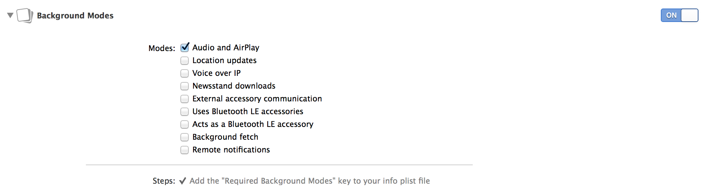

Hysteria Player
=========

HysteriaPlayer provides useful basic player functionalities.

It provides:
- PlayerItem cache management.
- Pre-buffer next PlayerItem. 

Features:

- Supporting both local and remote media.
- Setting up HysteriaPlayer with few blocks, implementing delegates in your `UIView` and `UIViewController` subclasses to update UI when player event changed.
- Ability to advance next/previous item.
- If player suspended bacause of buffering issue, auto-resume the playback when buffered size reached 5 secs. 
- Background playable. (check the background audio mode then everything works)
- Using getHysteriaOrder: to get the index of your PlayerItems.
- Extends long time buffering in background.
- Player modes support: Repeat, RepeatOne, Shuffle.

Tutorials
---------------
In [part 0](http://imnotyourson.com/streaming-remote-audio-on-ios-with-hysteriaplayer-tutorial-0/), what we want? why HysteriaPlayer?

In [part 1](http://imnotyourson.com/streaming-remote-audio-on-ios-with-hysteriaplayer-tutorial-1/), demonstrating how to play remote audios with HysteriaPlayer. (version 2.0.0, a little bit outdated. [version 2.1.0 modified some APIs](https://github.com/StreetVoice/HysteriaPlayer/releases/tag/2.1.0))

In [part 2](http://imnotyourson.com/streaming-remote-audio-on-ios-with-hysteriaplayer-tutorial-2/), making a simple player user interface. 

You can download tutorial source code [here](https://github.com/saiday/HysteriaPlayerTutorial)

Installation
---------------

### CocoaPods ###

If you using [CocoaPods](http://cocoapods.org/), it's easy to install HysteriaPlayer.

Podfile:

```
platform :ios, 'x.0'

pod 'HysteriaPlayer',			        '~> x.x.x'
    
end
```

### Manually install ###
#### Import library to your project ####

Drag `HysteriaPlayer.m`, `HysteriaPlayer.h` to your project.

#### Add Frameworks ####

Add CoreMedia.framework, AudioToolbox.framework and AVFoundation.framework to your Link Binary With Libraries.

#### Copy provided point1sec.mp3 file to your Supporting Files ####

Ability to play the __first__ PlayerItem when your application is resigned active but __first__ PlayerItem is still buffering. 

Background modes for audio playback
----------

Xcode providing GUI checkbox to enable various background modes. Enable **Audio and AirPlay**, you can find this section from `Project -> Capabilities -> Background Modes`.



How to use
---------------

#### Delegate, DataSource ####

Implement `HysteriaPlayerDelegate` and `HysteriaPlayerDataSource` in your own playback configurator model. (It can be an `UIViewController` subclass as well but make it a standalone model makes more sense.)

```objective-c
#import "HysteriaPlayer.h"

@interface ViewController : UIViewController <HysteriaPlayerDelegate, HysteriaPlayerDataSource>
```

There are 4 optional delegates in `HysteriaPlayerDelegate`:
```objective-c
@optional
- (void)hysteriaPlayerWillChangedAtIndex:(NSUInteger)index;
- (void)hysteriaPlayerCurrentItemChanged:(AVPlayerItem *)item;
- (void)hysteriaPlayerRateChanged:(BOOL)isPlaying;
- (void)hysteriaPlayerDidReachEnd;
- (void)hysteriaPlayerCurrentItemPreloaded:(CMTime)time;
- (void)hysteriaPlayerDidFailed:(HysteriaPlayerFailed)identifier error:(NSError *)error;
- (void)hysteriaPlayerReadyToPlay:(HysteriaPlayerReadyToPlay)identifier;
```

3 optional delegates in `HysteriaPlayerDataSource`:
```objective-c
@optional
- (NSUInteger)hysteriaPlayerNumberOfItems;
- (NSURL *)hysteriaPlayerURLForItemAtIndex:(NSUInteger)index preBuffer:(BOOL)preBuffer;
- (void)hysteriaPlayerAsyncSetUrlForItemAtIndex:(NSUInteger)index preBuffer:(BOOL)preBuffer;
```

If you don't implement `hysteriaPlayerNumberOfItems` delegate method, you have to set `itemsCount` property to HysteriaPlayer.

And you must implement one of `hysteriaPlayerURLForItemAtIndex:preBuffer` or `hysteriaPlayerAsyncSetUrlForItemAtIndex:preBuffer` delegate method.

#### Setup ####

```objective-c
...

- (void)setupHyseteriaPlayer
{
    HysteriaPlayer *hysteriaPlayer = [HysteriaPlayer sharedInstance];
    hysteriaPlayer.delegate = self;
    hysteriaPlayer.datasource = self;
}

- (NSUInteger)hysteriaPlayerNumberOfItems
{
    return self.itemsCount;
}

- (NSURL *)hysteriaPlayerURLForItemAtIndex:(NSUInteger)index preBuffer:(BOOL)preBuffer
{
    return [[NSURL alloc] initFileURLWithPath:[localMedias objectAtIndex:index]];
}
```

Snippets
--------------
### Get item's index of my working items: ###
```objective-c
HysteriaPlayer *hysteriaPlayer = [HysteriaPlayer sharedInstance];
NSNumber *order = [hysteriaPlayer getHysteriaOrder:[hysteriaPlayer getCurrentItem]];
```

### Get playing item's timescale ###

```objective-c
HysteriaPlayer *hysteriaPlayer = [HysteriaPlayer sharedInstance];
NSDictionary *dict = [hysteriaPlayer getPlayerTime];
double durationTime = [[dict objectForKey:@"DurationTime"] doubleValue];
double currentTime = [[dict objectForKey:@"CurrentTime"] doubleValue];
```

### Get Player status ###
```objective-c
switch ([hysteriaPlayer getHysteriaPlayerStatus]) {
    case HysteriaPlayerStatusUnknown:
        
        break;
    case HysteriaPlayerStatusForcePause:
        
        break;
    case HysteriaPlayerStatusBuffering:
        
        break;
    case HysteriaPlayerStatusPlaying:
        
    default:
        break;
}
```

### Disable played item caching ###
Default is cache enabled
```objective-c
HysteriaPlayer *hysteriaPlayer = [HysteriaPlayer sharedInstance];
[hysteriaPlayer enableMemoryCached:NO];
```

### What if I don't need player instance anymore? ###
```objective-c
HysteriaPlayer *hysteriaPlayer = [HysteriaPlayer sharedInstance];
[hysteriaPlayer deprecatePlayer];
hysteriaPlayer = nil;
```

## Known Issues
If you going to play HTTP Live streaming on iOS 8 and below. (iOS 9+ is fine, no worries)  
There's a property you had to set at very first time when HysteriaPlayer is initiated.
```objective-c
HysteriaPlayer *hysteriaPlayer = [HysteriaPlayer sharedInstance];
hysteriaPlayer.skipEmptySoundPlaying = YES;
```

## Licenses ##

All source code is licensed under the MIT License.

## Author ##

Created by Saiday
 
* [GitHub](https://github.com/saiday/)
* [Twitter](https://twitter.com/saiday)
* Skype: imnotyourson
